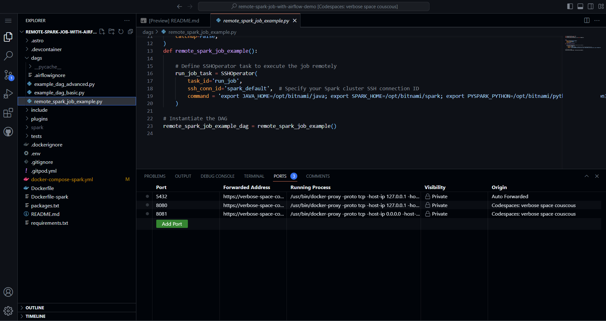
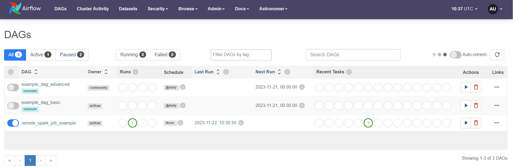
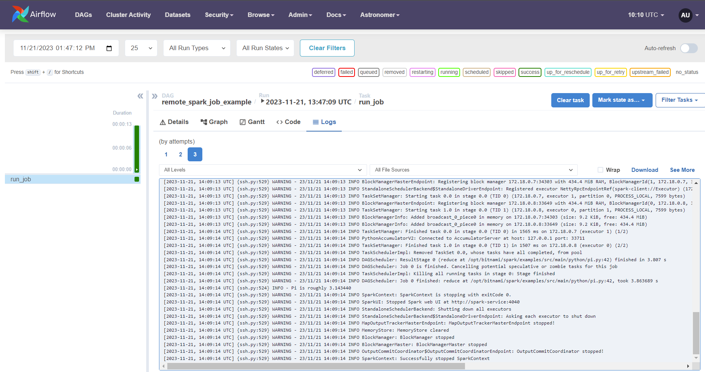
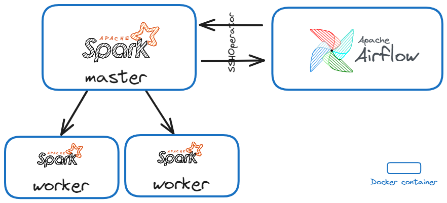

Overview
========

Welcome to this demo repository to show how to run pyspark applications on remote spark clusters using SSHOperator :rocket:.

This Airflow pipeline will trigger the execution of a basic pyspark application that can be tested on other applications.

-------------------------------

How to use this repository
==========================

## Setting up

### Option 1: Use GitHub Codespaces

Run this Airflow project without installing anything locally.

1. Fork this repository.
2. Create a new GitHub codespaces project on your fork. Make sure it uses at least 4 cores!
3. After creating the codespaces project the Astro CLI will automatically start up all necessary Airflow components. This can take a few minutes. 
4. Once the Airflow project has started access the Airflow UI by clicking on the **Ports** tab and opening the forward URL for port 8080.

### Option 2: Use Gitpod

1. Install the Gitpod extension for your browser:
   - [Gitpod for Chrome](https://chrome.google.com/webstore/detail/gitpod-online-ide/dodmmooeoklaejobgleioelladacbeki)
   - [Gitpod for Firefox](https://addons.mozilla.org/firefox/addon/gitpod/)

2. Click on the Gitpod button that appears in your browser after installing the extension. This will open the project in Gitpod.

3. After Gitpod initializes, the Astro CLI will automatically start up all necessary Airflow components. This can take a few minutes.

4. Once the Airflow project has started, access the Airflow UI by clicking on the **Ports** tab and opening the forward URL for port 8080.

   

## Run the project

1. Unpause `remote_spark_job_example` DAG, by clicking on the toggle on the left hand side. Once the `remote_spark_job_example` DAG is unpaused it will run once, starting the pipeline.

 
 
2. To open the Spark UI app, go to the **Ports** tab and open the URL of the forwarded port `8081`.

3. To see the logs of the execution of the spark job, access the logs of the `run_job` task.

   

-------------------------------

How it works
============

## Components and infrastructure

This repository uses a [custom codespaces container](https://github.com/astronomer/devcontainer-features/pkgs/container/devcontainer-features%2Fastro-cli) to install the [Astro CLI](https://docs.astronomer.io/astro/cli/install-cli). The GH codespaces post creation command will start up the Astro project by running `astro dev start`. 

5 Docker containers will be created and relevant ports will be forwarded:

- The Airflow scheduler
- The Airflow webserver
- The Airflow metastore
- The Airflow triggerer
- A Spark master
- 2 Spark workers

  
  
-------------------------------

Project Structure
================

This repository contains the following files and folders:

- `.astro`: files necessary for Astro CLI commands.
- `.devcontainer`: the GH codespaces configuration.
-  `dags`: all DAGs in your Airflow environment.
- `plugins`: folder to place Airflow plugins. Empty.
- `tests`: folder to place pytests running on DAGs in the Airflow instance. Contains default tests.
- `.dockerignore`: list of files to ignore for Docker.
- `.env`: environment variables. Contains the definition for the SSH Spark connection.
- `.gitignore`: list of files to ignore for git. Note that `.env` is not ignored in this project.
- `docker-compose-spark.yml`: Config file a Spark cluster with a master node and two workers.
- `Dockerfile-spark` : Configures Spark image with SSH, adds user, and starts SSH server.
- `packages.txt`: system-level packages to be installed in the Airflow environment upon building of the Dockerimage.
- `README.md`: this Readme.
- `requirements.txt`: python packages to be installed to be used by DAGs upon building of the Dockerimage.
- `.gitpod.yml` : This file instructs Gitpod on how to prepare and build the project in case you run it on gitpod.

